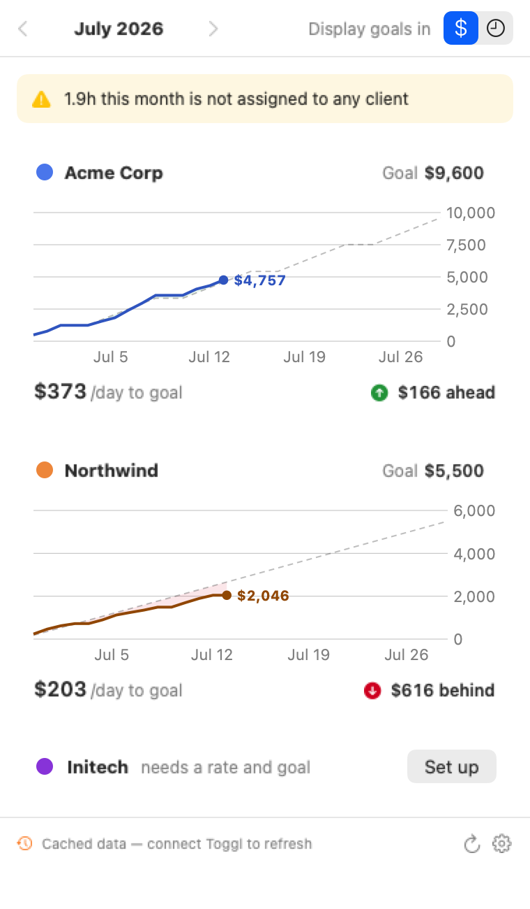
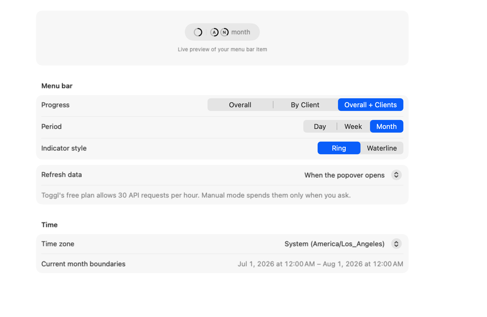
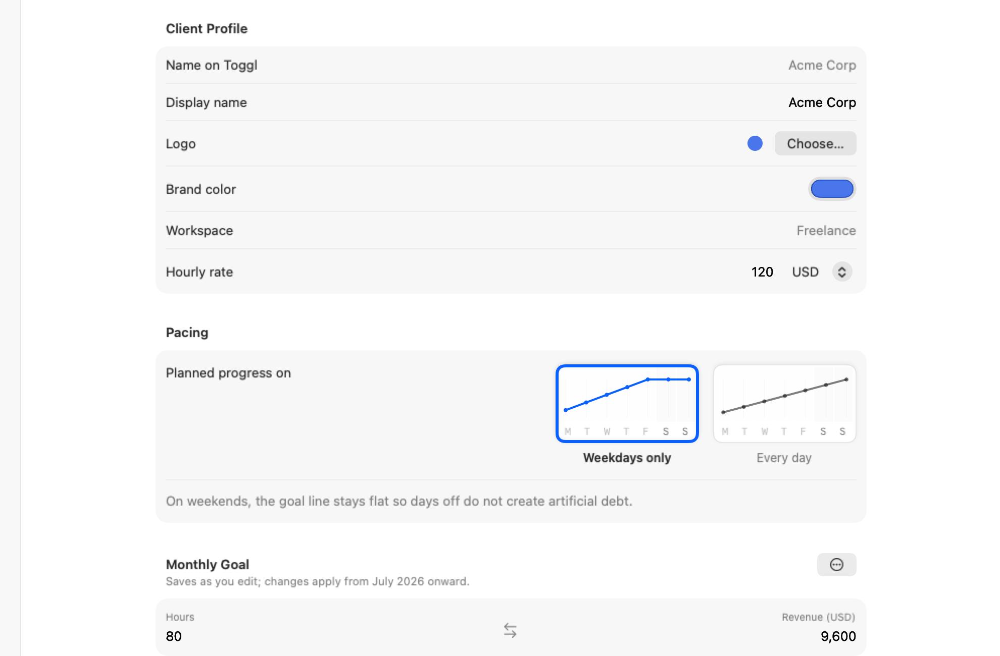

# Momenta

Momenta is a native macOS menu bar app for hourly freelancers who track work
in Toggl Track. It turns time entries, hourly rates, and monthly goals into a
compact answer to one question: **am I on pace?**

<p align="center">
  
</p>

Momenta is read-only over Toggl. It never starts, stops, creates, or edits a
time entry.

> **Project status:** pre-release (`0.1.0`). The core calculation, persistence,
> and presentation flows are covered by automated tests. Real-account
> end-to-end validation and a signed, notarized distribution remain before the
> first public release.

## Highlights

- **Progress in the menu bar.** Show overall progress, individual clients, or
  both for today, this week, or this month.
- **Two compact visual forms.** Choose rings or waterlines without spending
  menu bar space on redundant percentages.
- **A useful popover.** Compare planned and actual progress, see whether each
  client is ahead or behind, and review the daily pace required to reach the
  goal.
- **Pacing that matches the engagement.** Spread a goal across weekdays only
  or every calendar day.
- **Historical goals.** Review earlier months against the goal and rate that
  were recorded for that month.
- **Offline continuity.** Keep the last successful snapshot visible when
  Toggl is unavailable or the Mac is offline.

| Display and refresh preferences | Client profile and pacing |
| --- | --- |
|  |  |

## Requirements

### To run Momenta

- macOS 26 or later
- A Toggl Track account and API token for live data

Before the first Toggl account is connected, Momenta uses deterministic demo
data so the interface can be explored safely. When disconnecting an account,
you can keep cached real snapshots for offline viewing or clear them at the
same time; demo data never replaces a real client configuration.

No prebuilt download is published during pre-release. Build and run Momenta
from Xcode using the instructions in [Development](#development).

### To develop Momenta

- Xcode 27 beta or later
- Swift 6
- An Apple Development signing identity for running a signed local build

The current project deployment target is macOS 26.0. The release and test
commands below are verified with Xcode 27 beta on macOS 27.

## Quick start

1. **Connect Toggl.** Open **Settings → Account**, paste the API token from
   **Toggl Track → Profile → API Token**, then choose **Connect**. Momenta
   validates the token before storing it in the macOS Keychain.
2. **Choose clients.** Open **Settings → Clients**, refresh the client list,
   and enable the clients that should contribute to progress.
3. **Set each goal.** Select an enabled client, enter its hourly rate and a
   monthly goal in hours or revenue, then choose its pacing mode. Editing one
   goal value updates the other using the hourly rate.

Toggl entries must use a project that is linked to the intended Toggl client.
Entries without a project, or whose project has no client, remain visible as
uncategorized time instead of contributing to a client goal.

After at least one enabled client has a complete rate and goal, choose
**Refresh** to fetch a snapshot. The status item then begins showing progress.

## Display and pacing

### Menu bar

Momenta exposes three independent display choices in **Settings → Display**
and in the status item's context menu:

| Setting | Options | Meaning |
| --- | --- | --- |
| Content | Overall, By Client, Overall + Clients | Choose aggregate progress, individual client progress, or both. |
| Period | Day, Week, Month | Compare today with the current catch-up pace, or limit actual and planned progress to the current week/month. |
| Visualization | Ring, Waterline | Change the compact progress glyph without changing the underlying value. |

Overall progress is revenue-based because client hours with different rates
cannot be summed meaningfully. Individual client cards can be viewed in hours
or revenue.

In **Day** mode, each client ring uses the same live denominator shown as
**/day to goal** on its client card. Falling behind earlier in the month raises
today's threshold; getting ahead lowers it. Week and Month modes continue to
use the planned share of the monthly goal for their selected calendar slice.

### Pacing

- **Weekdays only** assigns planned progress to Monday through Friday. The
  planned line stays flat on weekends, so days off do not create artificial
  debt.
- **Every day** spreads the monthly goal across every calendar day.

Pacing changes only the planned line and required daily pace. It never changes
the Toggl entries counted as actual work.

### Refresh behavior

By default, app launch and opening the popover use the automatic refresh path,
which fetches live data at most once per minute. **Manually only** disables
that automatic refresh; the Refresh command always bypasses the throttle. This
mode is useful for Toggl plans with a limited API request budget.

## Privacy and local data

Momenta has no account service or application backend of its own. Live network
requests go directly to the read-only endpoints used by the Toggl Track API v9
at `https://api.track.toggl.com/api/v9`.

| Data | Storage and behavior |
| --- | --- |
| Toggl API token | Stored as a generic password in the macOS Keychain. It is never written to UserDefaults, files, or logs. |
| Account metadata | Name, email, organization plan metadata, workspace metadata, connection date, and last-sync date are stored locally in UserDefaults. |
| Client preferences | Enabled state, display name, brand color, currency, pacing, hourly rate, and goal history are stored locally in UserDefaults. |
| Time-entry snapshots | The last successful monthly snapshots are stored as JSON in Momenta's sandboxed Application Support directory for offline viewing. A snapshot contains entry and client identifiers plus start and stop times, but not entry descriptions. |
| Imported client logos | Copied into Momenta's sandboxed Application Support directory after explicit selection in the system file picker. |
| Demo data | Generated deterministically and never written to the snapshot cache. |

Disconnecting always removes the API token from Keychain and removes the
cached account metadata. The disconnect dialog also offers to clear cached
monthly snapshots. Client preferences, display settings, and imported logos
remain local so they can be reused after reconnecting.

Momenta does not contain an analytics or advertising SDK and does not send
Toggl data to a Momenta-operated server.

## Known limitations

- The current build is pre-release and still needs final end-to-end validation
  against a real Toggl account before public distribution.
- There is not yet a signed and notarized downloadable build or an automatic
  update channel.
- Toggl free-plan API limits can temporarily prevent refreshes. Momenta
  classifies that response and continues showing the last cached snapshot.
- Momenta fetches the current month and the previous two months on demand.
  Older months remain available only when a snapshot was already cached.
- Momenta reads time entries for the connected user, not every member of a
  Toggl workspace or organization.
- Toggl's time-entry history endpoint
  [returns at most 1,000 entries](https://engineering.toggl.com/docs/tracking/#time-entry-history)
  for a requested window. Momenta does not yet fall back to Detailed Reports,
  so exceptionally busy accounts can produce an incomplete snapshot.
- Toggl time entries are associated with clients through their projects. An
  entry without a project, or whose project has no client, is shown as
  uncategorized.
- Revenue is an estimate calculated from the locally configured hourly rate
  and all client-linked hours. Momenta does not use Toggl's billable flag or
  Toggl billing rates.
- Overall progress adds configured revenue values directly. It does not
  perform exchange-rate conversion, so an overall view should not combine
  clients configured with different currencies.
- A time entry is attributed to the day, week, and month in which it starts.
  Work that crosses midnight is not split across calendar boundaries.
- Running entries advance only when a snapshot is refreshed; the displayed
  value does not tick continuously between syncs.
- Project-to-client mappings are cached for 15 minutes to reduce Toggl API
  usage. A mapping changed in Toggl can therefore take up to 15 minutes to
  appear in Momenta.
- There is no single **Reset All Data** action yet. Disconnecting can clear the
  token, account metadata, and snapshot cache, but local client preferences,
  logos, and display settings remain.

## Troubleshooting

### The menu bar item is missing

Momenta is a menu bar app and intentionally has no Dock icon. Check the menu
bar and any macOS hidden-item area. If a development build is already running,
quit it before opening another configuration.

### A client does not appear in progress

Open **Settings → Clients** and confirm that the client is enabled and has a
complete hourly rate and monthly goal for the selected month. Use **Refresh
from Toggl** if the client was added or renamed recently.

### Data is stale or refresh reports an API quota error

The last successful snapshot remains visible offline. Reconnect the network
and refresh manually. After a Toggl quota response, wait for the request budget
to reset and consider selecting **Manually only** under **Refresh data**.

### macOS asks for Keychain access

For a trusted, consistently signed build, choose **Always Allow** so subsequent
launches can read the saved Toggl token without another prompt. A differently
signed Debug or Release binary may be treated as a different requester.

### Debug and Release both appear on the Mac

Development builds are separate app bundles and Spotlight may index both. Use
the configuration label shown by Spotlight, or launch the exact product from
Xcode's Products directory. Because development copies can share a bundle ID
and URL scheme, quit and remove obsolete copies when they are no longer needed.

### `xcodebuild` selects the wrong Xcode

Point the command at the beta toolchain without changing the system-wide
selection:

```sh
DEVELOPER_DIR="/path/to/Xcode-beta.app/Contents/Developer" \
  xcodebuild -version
```

## Support and feedback

Report bugs and suggest improvements through
[GitHub Issues](https://github.com/gitacoco/Momenta/issues). Include the
Momenta version, macOS version, relevant display settings, and clear steps to
reproduce the problem. Never include your Toggl API token in an issue.

## Development

Clone the repository, then point each command at Xcode 27 beta. For example,
if the beta is in `~/Downloads`:

```sh
export DEVELOPER_DIR="$HOME/Downloads/Xcode-beta.app/Contents/Developer"
```

Verify a Release build without depending on the repository owner's signing
team:

```sh
xcodebuild \
  -project Momenta.xcodeproj \
  -scheme Momenta \
  -configuration Release \
  -destination 'platform=macOS' \
  CODE_SIGNING_ALLOWED=NO \
  build
```

Run the full test suite:

```sh
xcodebuild \
  -project Momenta.xcodeproj \
  -scheme Momenta \
  -destination 'platform=macOS' \
  CODE_SIGNING_ALLOWED=NO \
  test
```

To run Momenta from Xcode, select your own development team for the Momenta
target so the app and its Keychain access use a stable Apple Development
identity.

### Project layout

```text
Momenta/
  App/       App entry point, observable app state, and persistence
  Data/      Toggl API, Keychain, cache, logo storage, and demo provider
  Engine/    Progress, pacing, aggregation, and period calculations
  Models/    Client, goal, time-entry, and display settings models
  UI/        Menu bar label, popover dashboard, and settings window
MomentaTests/  Unit tests for models, persistence, API behavior, and calculations
```

## License

Momenta is available under the [MIT License](LICENSE).
