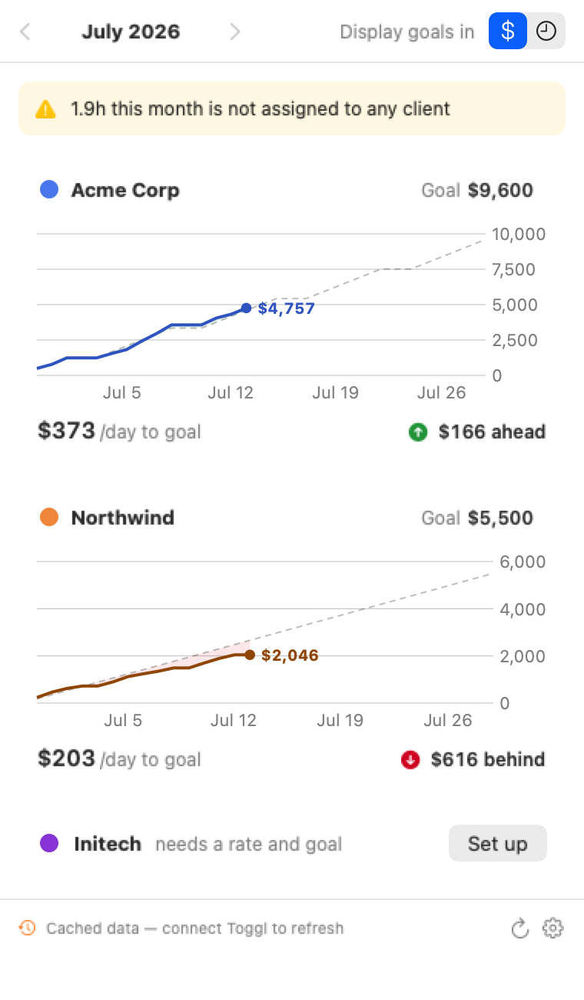
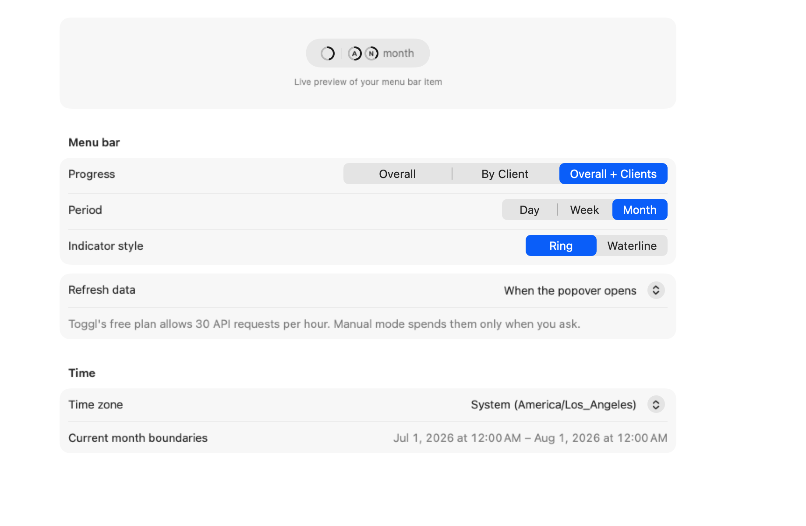
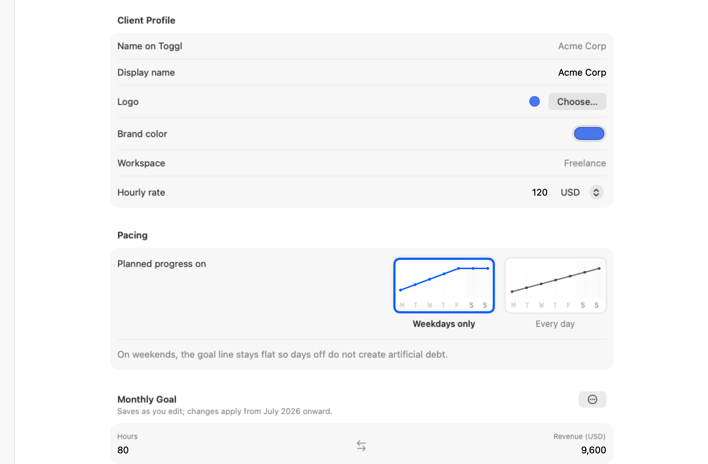

# Momenta

Momenta is a native macOS menu bar app for hourly freelancers who track work
in Toggl Track. It turns time entries, hourly rates, and monthly goals into a
compact answer to one question: **am I on pace?**

<p align="center">
  
</p>

Momenta is read-only over Toggl. It never starts, stops, creates, or edits a
time entry.

> **Project status:** pre-release (`0.1.0`). The core calculation, persistence,
> and presentation flows are covered by automated tests. Real-account
> end-to-end validation and a signed, notarized distribution remain before the
> first public release.

## Highlights

- **Progress in the menu bar.** Show Overall progress, individual clients, or
  both for today, this week, or this month, using rings or waterlines.
- **An honest daily target.** Today's goal is frozen at the start of the day,
  while an optional intraday timeline ramps the plan only inside each client's
  work hours.
- **Flexible client goals.** Track billable work in hours or revenue,
  hours-only non-billable work, custom workdays, monthly goal history, and
  per-client branding.
- **A useful dashboard.** Compare planned and actual progress, move through
  earlier periods, switch between hours and revenue, and see exactly why data
  is missing or stale.
- **Offline continuity.** Keep the last successful snapshot visible when
  Toggl is unavailable or the Mac is offline.

| Display and refresh preferences | Client profile and pacing |
| --- | --- |
|  |  |

## Requirements

### To run Momenta

- macOS 26 or later
- A Toggl Track account and API token for live data

Before the first Toggl account is connected, Momenta uses deterministic demo
data so the interface can be explored safely. When disconnecting an account,
you can keep cached real snapshots for offline viewing or clear them at the
same time; demo data never replaces a real client configuration.

No prebuilt download is published during pre-release. Build and run Momenta
from Xcode using the instructions in [Development](#development).

### To develop Momenta

- Xcode 26.6 with the macOS 26 SDK (the currently verified toolchain)
- Swift 6
- Git
- An Apple Development signing identity only if you want to run a signed local
  build; unsigned command-line builds and tests do not require one

The current project deployment target is macOS 26.0. The release and test
commands below are verified with Xcode 26.6 on macOS 27.

## Get a Toggl API token

Momenta uses your personal Toggl Track API token. It does not ask for or store
your Toggl password.

1. Sign in to [Toggl Track](https://track.toggl.com).
2. Select your profile icon in the lower-left corner and open **Profile**.
3. Scroll to the **API Token** section at the bottom of the Profile page.
4. Copy the token. Toggl's
   [token-location guide](https://support.toggl.com/en-us/article/where-is-my-api-key-located-e9ki6p/)
   links directly to the current Profile page if the navigation changes.
5. In Momenta, open **Settings → Account**, paste the token into
   **Toggl API token**, and choose **Connect**.

Momenta validates the token with Toggl before saving it as a generic password
in the macOS Keychain. Treat the token like a password: do not put it in source
code, terminal history, screenshots, logs, or bug reports. If it is exposed,
reset it from the same Toggl Profile page; the previous token will stop working
and Momenta will need to reconnect with the replacement.

## Quick start

1. **Launch Momenta.** It appears in the menu bar and intentionally has no Dock
   icon. Before an account is connected, the dashboard uses demo data.
2. **Connect Toggl.** Open **Settings → Account**, paste the
   [API token obtained above](#get-a-toggl-api-token), and choose **Connect**.
3. **Choose clients.** Open **Settings → Clients**, refresh the client list,
   and enable the clients that should contribute to progress.
4. **Configure each client.** Choose whether it is billable, then enter its
   hourly rate when applicable, monthly goal, pacing days, and work hours.
   A billable goal can be entered in hours or revenue; Momenta keeps the two
   values in sync using the hourly rate.
5. **Refresh and review.** Return to the menu-bar dashboard and choose
   **Refresh**. Use the Day, Week, and Month controls to compare actual work
   with the plan.

Toggl entries must use a project that is linked to the intended Toggl client.
Entries without a project, or whose project has no client, remain visible as
uncategorized time instead of contributing to a client goal.

## Features

### Menu bar and dashboard

Select the menu-bar item to open the dashboard. Secondary-click it to open a
context menu with Settings, display controls, the last query time, Refresh, and
Quit.

Momenta exposes four independent display choices in **Settings → Display**.
Progress, period, and indicator style are also available from the menu-bar
context menu:

| Setting | Options | Meaning |
| --- | --- | --- |
| Progress | Overall, By Client, Overall + Clients | Choose aggregate progress, individual client progress, or both. |
| Period | Day, Week, Month | Show the current daily target or the selected week/month plan. |
| Indicator style | Ring, Waterline | Change the compact progress glyph without changing the underlying value. |
| Overall percentage | Off, On | Optionally show the numeric Overall percentage beside its indicator. |

The dashboard adds:

- Back and forward navigation through earlier days, weeks, and months, plus a
  **Back to Today** action.
- An hours/revenue switch. Non-billable clients appear in hours mode and are
  intentionally absent from revenue mode.
- An Overall row and one card per enabled client, with setup, missing-data,
  stale-cache, quota, and uncategorized-time states shown explicitly.
- Direct links from incomplete cards to the corresponding client settings.

### Period views and goal semantics

Overall progress is revenue-based because hours billed at different rates
cannot be summed meaningfully. Individual client cards can be viewed in hours
or revenue.

In **Day** mode, the Overall ring compares today's total estimated revenue with
a target frozen at the start of the day: combined remaining monthly revenue
divided by the remaining scheduled days. Revenue from any configured client
counts toward the same total, so overperformance for one client can offset
another. Reaching 100% on every scheduled day therefore keeps the combined
monthly revenue goal on track.

Each client ring remains independent and uses that client's own goal for today,
frozen the same way: its remaining monthly hours at the start of the day divided
by its remaining scheduled days. Because today's own work never enters that
denominator, the target holds still all day — yesterday's shortfall raises it and
yesterday's surplus lowers it, but logging against it never moves it. The day
completes only when the work is actually done.

Client cards in Day, Week, and Month have two styles, selected beside the
period control in the summary row. The selected style stays the same when
switching periods and is remembered after relaunch:

- **Capsule** compares accumulated work with the period's goal: the frozen
  daily goal, the week's target, or the full monthly goal.
- **Timeline** plots cumulative actual work against the plan. In Day, the
  plan is flat before the client's work window, rises through that window,
  and stays flat afterward. The Day ahead/behind result compares actual work
  with the plan at the current time, so a morning before work starts does not
  read as debt.

On a scheduled day off, both styles show **Day off** without a plan or artificial
debt. Work logged on that day still counts as actual progress.

**Week** and **Month** compare actual progress with the planned share of the
monthly goal for the selected calendar interval. Both lead with
**/day to goal**, the live catch-up pace required over the remaining scheduled
days. Unlike the Day target, this forward-looking rate falls as work is logged.

### Client configuration

**Settings → Clients** imports clients from every visible Toggl workspace and
groups them by workspace. For each client you can:

- Enable or hide it without deleting its local configuration.
- Override its display name, choose a brand color, and import or remove a logo.
- Mark it billable or non-billable. Billable clients have a currency and hourly
  rate; non-billable clients use hours-only goals.
- Set a monthly goal in hours or revenue. Goal and rate changes are versioned
  from the selected month onward so historical months retain their original
  values.
- Pace the goal over weekdays, every calendar day, or a custom set of weekdays.
- Set the daily work window used by the Day timeline (default: 9:00–18:00).

Clients archived in Toggl remain available for historical data, but their
Momenta configuration becomes read-only.

Pacing changes only planned progress and the required daily pace. It never
changes which Toggl entries count as actual work.

### Refresh and offline behavior

**When the popover opens** refreshes on app launch, foreground activation, and
popover presentation, with a one-minute throttle across those events. **On a
set interval** refreshes once at app launch and then on the selected cadence;
opening the popover does not fetch data. **Manually only** disables both
automatic paths. The Refresh command always performs an immediate refresh.

Momenta caches successful monthly snapshots locally. If Toggl is unavailable,
the network is offline, or a quota is reached, the dashboard keeps the last
snapshot visible and marks it as stale. It fetches the current month and the
previous two months on demand; already cached older months remain navigable.

## Privacy and local data

Momenta has no account service or application backend of its own. Live network
requests go directly to the read-only endpoints used by the Toggl Track API v9
at `https://api.track.toggl.com/api/v9`.

| Data | Storage and behavior |
| --- | --- |
| Toggl API token | Stored as a generic password in the macOS Keychain. It is never written to UserDefaults, files, or logs. |
| Account metadata | Name, email, organization plan metadata, workspace metadata, connection date, and last-sync date are stored locally in UserDefaults. |
| Client preferences | Enabled and billable state, display name, brand color, currency, pacing days, work hours, hourly rate, and goal history are stored locally in UserDefaults. |
| Time-entry snapshots | The last successful monthly snapshots are stored as JSON in Momenta's sandboxed Application Support directory for offline viewing. A snapshot contains entry and client identifiers plus start and stop times, but not entry descriptions. |
| Imported client logos | Copied into Momenta's sandboxed Application Support directory after explicit selection in the system file picker. |
| Demo data | Generated deterministically and never written to the snapshot cache. |

Disconnecting always removes the API token from Keychain and removes the
cached account metadata. The disconnect dialog also offers to clear cached
monthly snapshots. Client preferences, display settings, and imported logos
remain local so they can be reused after reconnecting.

Momenta does not contain an analytics or advertising SDK and does not send
Toggl data to a Momenta-operated server.

## Known limitations

- The current build is pre-release and still needs final end-to-end validation
  against a real Toggl account before public distribution.
- There is not yet a signed and notarized downloadable build or an automatic
  update channel.
- Toggl free-plan API limits can temporarily prevent refreshes. Momenta
  classifies that response and continues showing the last cached snapshot.
- Momenta fetches the current month and the previous two months on demand.
  Older months remain available only when a snapshot was already cached.
- Momenta reads time entries for the connected user, not every member of a
  Toggl workspace or organization.
- Toggl's time-entry history endpoint
  [returns at most 1,000 entries](https://engineering.toggl.com/docs/tracking/#time-entry-history)
  for a requested window. Momenta does not yet fall back to Detailed Reports,
  so exceptionally busy accounts can produce an incomplete snapshot.
- Toggl time entries are associated with clients through their projects. An
  entry without a project, or whose project has no client, is shown as
  uncategorized.
- Revenue is an estimate calculated from the locally configured hourly rate
  and all client-linked hours. Momenta does not use Toggl's billable flag or
  Toggl billing rates.
- Overall progress adds configured revenue values directly. It does not
  perform exchange-rate conversion, so an overall view should not combine
  clients configured with different currencies.
- A time entry is attributed to the day, week, and month in which it starts.
  Work that crosses midnight is not split across calendar boundaries.
- Running entries advance only when a snapshot is refreshed; the displayed
  value does not tick continuously between syncs.
- Project-to-client mappings are cached for 15 minutes to reduce Toggl API
  usage. A mapping changed in Toggl can therefore take up to 15 minutes to
  appear in Momenta.
- There is no single **Reset All Data** action yet. Disconnecting can clear the
  token, account metadata, and snapshot cache, but local client preferences,
  logos, and display settings remain.

## Troubleshooting

### The menu bar item is missing

Momenta is a menu bar app and intentionally has no Dock icon. Check the menu
bar and any macOS hidden-item area. If a development build is already running,
quit it before opening another configuration.

### A client does not appear in progress

Open **Settings → Clients** and confirm that the client is enabled and has a
monthly goal for the selected month. A billable client also needs an hourly
rate. Use **Refresh from Toggl** if the client was added or renamed recently.

### Data is stale or refresh reports an API quota error

The last successful snapshot remains visible offline. Reconnect the network
and refresh manually. After a Toggl quota response, wait for the request budget
to reset and consider selecting **Manually only** under **Refresh data**.

### macOS asks for Keychain access

For a trusted, consistently signed build, choose **Always Allow** so subsequent
launches can read the saved Toggl token without another prompt. A differently
signed Debug or Release binary may be treated as a different requester.

### Debug and Release both appear on the Mac

Development builds are separate app bundles and Spotlight may index both. Use
the configuration label shown by Spotlight, or launch the exact product from
Xcode's Products directory. Because development copies can share a bundle ID
and URL scheme, quit and remove obsolete copies when they are no longer needed.

### `xcodebuild` selects the wrong Xcode

Point the command at the intended Xcode without changing the system-wide
selection:

```sh
DEVELOPER_DIR="/Applications/Xcode.app/Contents/Developer" \
  xcodebuild -version
```

## Support and feedback

Report bugs and suggest improvements through
[GitHub Issues](https://github.com/gitacoco/Momenta/issues). Include the
Momenta version, macOS version, relevant display settings, and clear steps to
reproduce the problem. Never include your Toggl API token in an issue.

## Development

Momenta has no third-party package or bootstrap step. Clone the repository and
open the shared Xcode project:

```sh
git clone https://github.com/gitacoco/Momenta.git
cd Momenta
open Momenta.xcodeproj
```

### Run from Xcode

1. Select the **Momenta** scheme and **My Mac** destination.
2. Open the Momenta target's **Signing & Capabilities** settings, keep
   **Automatically manage signing** enabled, and select your development team.
3. If your team cannot register `com.zhibangjiang.Momenta`, change the app's
   bundle identifier to a unique reverse-DNS value for your local build.
4. Choose **Product → Run** (`⌘R`). Momenta appears in the menu bar rather than
   the Dock.

The default build uses the standard sandbox, outbound-network, and
user-selected-file entitlements. iCloud Sync is currently disabled, so a local
build does not require the repository owner's CloudKit container.

Keep one signing identity and bundle identifier while developing if you want
Keychain access to remain stable across rebuilds. macOS can prompt again when a
differently signed Debug or Release app requests the saved token.

### Build and test from the command line

Check the selected toolchain:

```sh
xcodebuild -version
xcrun --sdk macosx --show-sdk-version
```

Build Debug without depending on the repository owner's signing team:

```sh
xcodebuild \
  -project Momenta.xcodeproj \
  -scheme Momenta \
  -configuration Debug \
  -destination 'platform=macOS' \
  CODE_SIGNING_ALLOWED=NO \
  build
```

Verify the optimized Release configuration the same way:

```sh
xcodebuild \
  -project Momenta.xcodeproj \
  -scheme Momenta \
  -configuration Release \
  -destination 'platform=macOS' \
  CODE_SIGNING_ALLOWED=NO \
  build
```

Run the full unit-test suite:

```sh
xcodebuild \
  -project Momenta.xcodeproj \
  -scheme Momenta \
  -destination 'platform=macOS' \
  CODE_SIGNING_ALLOWED=NO \
  test
```

`CODE_SIGNING_ALLOWED=NO` is intended for build and test verification. For an
interactive local app with stable Keychain access, configure signing in Xcode
and run the Momenta scheme. Build products are placed in Xcode's DerivedData
directory under `Build/Products/Debug` or `Build/Products/Release`.

The current Release configuration uses an Apple Development identity. It is
not a distributable release: public distribution still requires a Developer ID
signature and notarization.

### Project layout

```text
Momenta/
  App/       App entry point, observable app state, and persistence
  Data/      Toggl API, Keychain, cache, logo storage, and demo provider
  Engine/    Progress, pacing, aggregation, and period calculations
  Models/    Client, goal, time-entry, and display settings models
  UI/        Menu bar label, popover dashboard, and settings window
MomentaTests/  Unit tests for models, persistence, API behavior, and calculations
```

## License

Momenta is available under the [MIT License](LICENSE).
